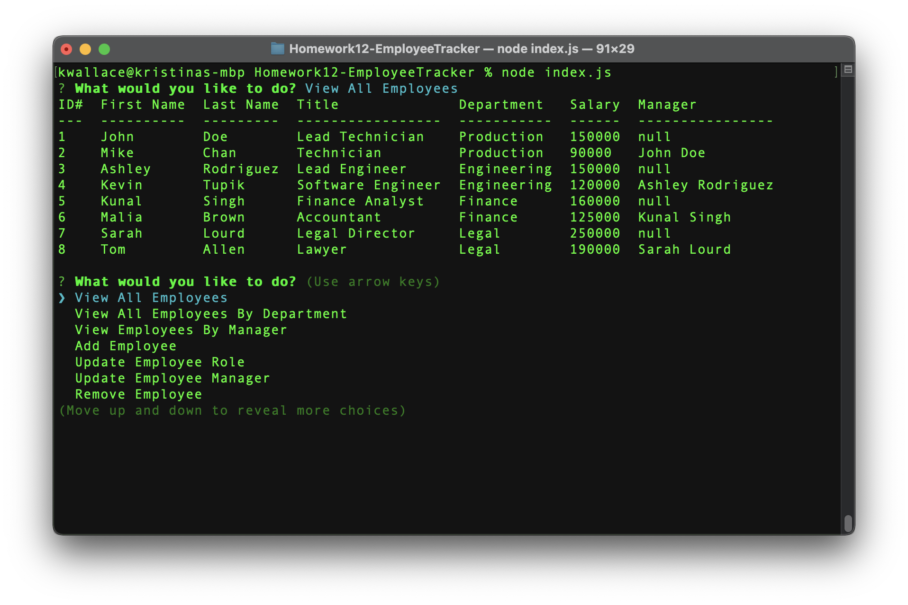

# Homework12-EmployeeTracker
Repository for Homework 12 - MySQL Employee Tracker

Developers are often tasked with creating interfaces that make it easy for non-developers to view and interact with information stored in databases. Often these interfaces are known as Content Management Systems. This application is a  solution for managing a company's employees using node, inquirer, and MySQL.

## Application instructions:
1. Start the application by typing node index.js in the terminal
2. Use the arrow keys to navigate the list of tasks to perform
3. Select an option and follow the prompts to complete the chosen task
5. Select Exit to end the application